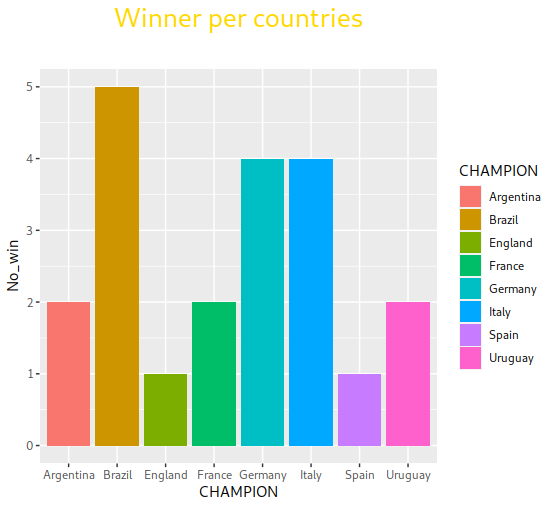
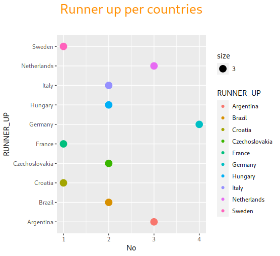
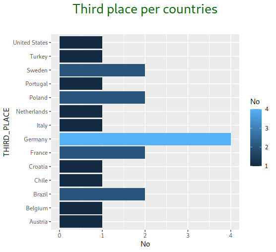
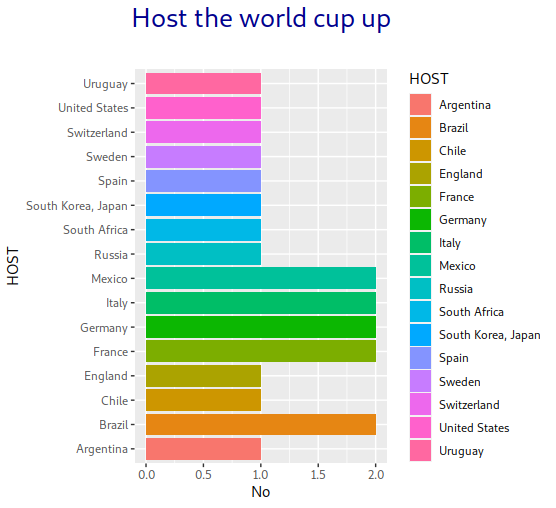

World Cup
================
Shivion Morgan

# Intro

The FIFA MEn’s World Cup, often called the World Cup is an international
association football competition. A contested for the senior men
national teams. Fédération Internationale de Football Association
(FIFA), the sport’s global governing body.

The championship played every four years since the inaugural tournament
in 1930. It’s was not held in 1942 and 1946 because of the Second World
War. The current champion is France, which won its second title at the
2018 tournament in Russia.

The World Cup will be playing in November 2022 in Qatar. The 2022 World
Cup will be the first time the tournament will be played from November
to December, the games are always played in the summer from July to
August.

This project is about world cup. I want to see the data from the past
world cup, how many hosts have hosted the world cup, which country won
the most and when.

I have chosen to use R for this project because that’s what I am
learning and needed to get more practice. R is a programming language
for statistical computing and graphics supported by the R Core Team and
the R Foundation for Statistical Computing.

# Dataset

The data set that is used for this analysis were downloaded from
[Kaggle](https://www.kaggle.com/iamsouravbanerjee/fifa-football-world-cup-dataset?select=FIFA+-+World+Cup+Summary.csv)

The World Cup data set shows information about all the World Cups from
1930 to 2018, while being; Year, Host, Champion, Runner\_up,
Third\_place, Team matches played, Goals scored, and Avg goal per game.

# Analysis and Visualization

### Winner

which countries won the most World Cup.

-   Brazil won the World Cup five times.

-   Italy and Germany both won it four times.

-   Uruguay was the first country to win the World cup in 1930.

### Runner UP

Which country place second

-   Germany is four times runner-up.

-   Netherlands and Argentina are both with three-time runner-up.

-   Argentina was the first country to come in second place.

## Third place

Which country have the most third place

-   Germany came third four times.

-   Sweden, Poland, France, and Brazil came in third place two times.

-   United States was the first country to place third.

## Host

Which country host the most World Cup.

-   Mexico, Italy, Germany, France, and Brazil hosted the World cup two
    times.

-   Uruguay was the first host.

## Host and Won

## Year \| Host and Win

-   1930 Uruguay  

-   1934 Italy

-   1966 England

-   1974 Germany

-   1978 Argentina

-   1998 France

-   Uruguay was the first to host and win the world cup back in 1930

-   France was the last country to host and win the world cup in 1998

# Conclusion

This data set has an unlimited number of options that could have been
explored. These are just a few that were studied; which country has won
the most World Cup, runner-up, and third place, who hosts the most World
Cup, and which country wins the World Cup they host. Thanks for reading
my project.
